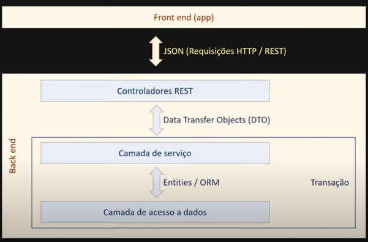

# Java e Spring: camadas, ORM e DTO
[Link de referencia](https://www.youtube.com/watch?v=7HvOBCqHWvA)

Exemplo de como utilizar o Design Pattern DTO (Data Transfer Object)
Este pequeno projeto foi desenvolvido seguindo a aula do professor Nelio Alves e tem como objetivo explicar como funciona o dto.

Aqui temos a arquitetura de como esta estruturado cada camada e como elas interagem entre si:

||
|---|

